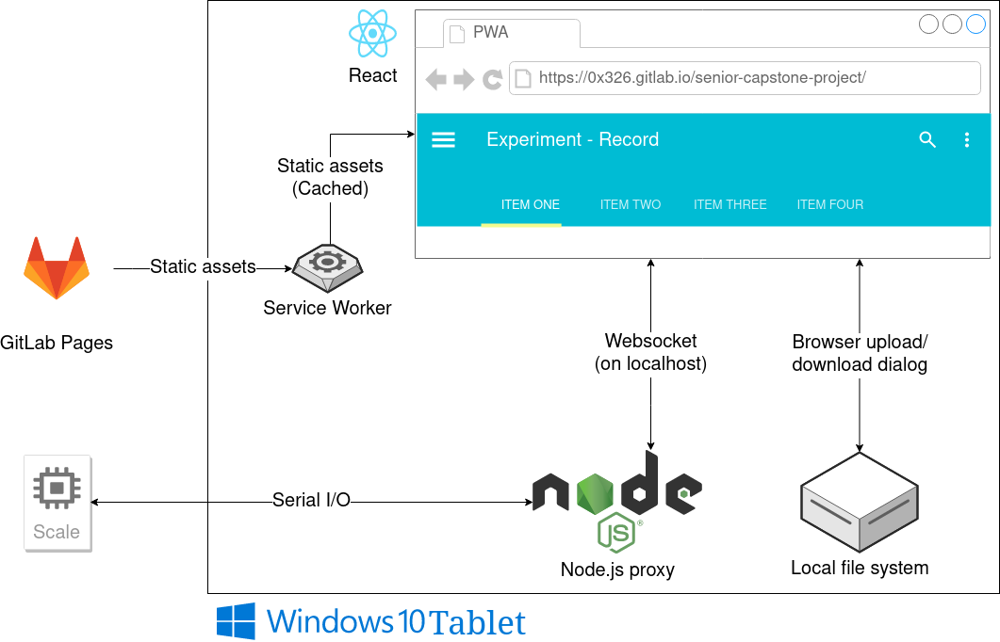

# Scale Interface Project: Installation Guide

> By: Nick DiGennaro, David Wimmel, Wael Elsharkawy, John Meyer

## Preface

### About the Documentation

This website is a centralized repository for *all* documentation related to our system. You can use
the search bar above to find the documentation you're looking for - this is especially useful for
searching the documentation of our codebase - or you can use the menu on the left. The menu on the
right is a table of contents for the current page you're on. It's useful for navigating the longer
developer documentation. Users will want to stick to the Install/Use section. The rest of the
documentation is for developers.

## Architecture

* NodeJS Proxy 
    * This component runs locally on the lab tablet. It interfaces with the scale hardware, and
      interprets data sent from the scale according to the communication standard defined in the
      manual.

* GitLab Pages
    * We are serving the web interface files through GitLab pages. GitLab pages is only capable of
      handling static sites, so all interactivity is performed through an SPA (Single Page
      Application) written in React.
    * The design of the web interface is currently very simple. Excel files containing experiment
      data are uploaded and downloaded through the usual browser dialogue. 

* Websocket-Based API Interface
    * Since the web-based interface is being run in the browser, we let the NodeJS proxy communicate
      with it through a Websocket intermediary. We've defined a basic communication standard to send
      weight data from the NodeJS proxy to the web interface.

These are the three major components of our architecture. More detailed information is available in
each of the three components' respective sections in **SRC**.
